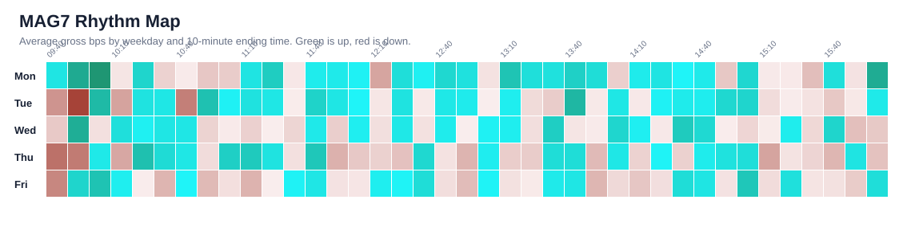

# MAG7 Patterns

This section isolates the largest technology-led names because they can dominate index behavior.

| Rank | Symbol | Pattern | Side | Avg Move | Win Rate | Test Avg | Years | Survival | Read |
|---:|---|---|---|---:|---:|---:|---:|---:|---|
| 1 | NVDA | Tue 13:30-13:40 | long | +5.015 bps | 57.1% | +5.586 bps | 6/6 | 97.5 A | Worth studying |
| 2 | NVDA | Tue 13:30-13:40 | long | +5.015 bps | 57.1% | +5.586 bps | 6/6 | 97.5 A | Worth studying |
| 3 | NVDA | Fri 12:40-12:50 | short | -4.144 bps | 44.2% | -5.590 bps | 6/6 | 96.2 A | Worth studying |
| 4 | AAPL | Thu 12:40-12:50 | short | -2.643 bps | 42.3% | -4.915 bps | 5/6 | 93.8 A | Worth studying |
| 5 | AAPL | Thu 10:00-10:10 | short | -4.290 bps | 43.0% | -3.889 bps | 6/6 | 93.6 B | Worth studying |
| 6 | AAPL | Thu 10:10-10:20 | long | +4.113 bps | 55.1% | +4.037 bps | 6/6 | 93.3 B | Worth studying |
| 7 | NVDA | Mon 12:10-12:20 | long | +3.099 bps | 52.4% | +6.090 bps | 5/6 | 93.1 A | Worth studying |
| 8 | AAPL | Fri 13:40-13:50 | short | -1.829 bps | 44.5% | -2.884 bps | 6/6 | 92.9 A | Worth studying |
| 9 | AAPL | Daily 09:50-10:00 | long | +2.140 bps | 53.1% | +2.374 bps | 6/6 | 92.7 A | Worth studying |
| 10 | AAPL | Wed 10:00-10:10 | long | +2.337 bps | 56.8% | +5.582 bps | 5/6 | 91.6 A | Worth studying |
| 11 | NVDA | Fri 12:20-12:30 | long | +2.671 bps | 50.7% | +3.080 bps | 6/6 | 90.8 B | Worth studying |
| 12 | NVDA | Tue 15:30-15:40 | short | -2.421 bps | 45.7% | -5.578 bps | 5/6 | 90.2 A | Worth studying |
| 13 | NVDA | Tue 10:30-10:40 | short | -5.230 bps | 46.8% | -6.286 bps | 5/6 | 88.0 B | Worth studying |
| 14 | AAPL | Tue 13:30-13:40 | long | +2.294 bps | 53.7% | +3.282 bps | 5/6 | 86.2 B | Worth studying |