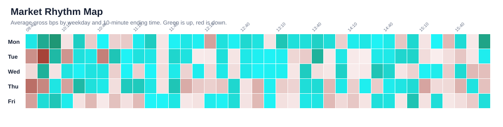

# Market-Wide Pattern Atlas

Symbols analyzed: 3. Main discovery layer: 10-minute regular-session windows.

Business question: is Tuesday 13:30-13:40 a broader market rhythm, or just a SPY quirk?

## Current Read

The three-symbol validation run is promising, but it is still a sample check. Treat this as evidence that the question is worth expanding, not as a market-wide conclusion yet.

## Pattern Survival Score

The survival score is a plain-English ranking aid. It rewards patterns that work across years, work in both train and test periods, and have enough observations. It penalizes tiny samples and one-regime stories.

## Strongest Long Windows

| Rank | Symbol | Pattern | Side | Avg Move | Win Rate | Test Avg | Years | Survival | Read |
|---:|---|---|---|---:|---:|---:|---:|---:|---|
| 1 | NVDA | Tue 13:30-13:40 | long | +5.015 bps | 57.1% | +5.586 bps | 6/6 | 97.5 A | Worth studying |
| 2 | SPY | Tue 13:30-13:40 | long | +2.054 bps | 60.6% | +3.030 bps | 6/6 | 96.2 A | Worth studying |
| 3 | AAPL | Thu 10:10-10:20 | long | +4.113 bps | 55.1% | +4.037 bps | 6/6 | 93.3 B | Worth studying |
| 4 | NVDA | Mon 12:10-12:20 | long | +3.099 bps | 52.4% | +6.090 bps | 5/6 | 93.1 A | Worth studying |
| 5 | AAPL | Daily 09:50-10:00 | long | +2.140 bps | 53.1% | +2.374 bps | 6/6 | 92.7 A | Worth studying |
| 6 | AAPL | Wed 10:00-10:10 | long | +2.337 bps | 56.8% | +5.582 bps | 5/6 | 91.6 A | Worth studying |
| 7 | NVDA | Fri 12:20-12:30 | long | +2.671 bps | 50.7% | +3.080 bps | 6/6 | 90.8 B | Worth studying |
| 8 | SPY | Wed 14:20-14:30 | long | +1.791 bps | 57.7% | +2.826 bps | 5/6 | 88.1 A | Worth studying |
| 9 | SPY | Mon 15:50-16:00 | long | +2.723 bps | 54.4% | +2.022 bps | 5/6 | 85.8 B | Worth studying |

## Tuesday 13:30-13:40 Across Symbols

| Rank | Symbol | Pattern | Side | Avg Move | Win Rate | Test Avg | Years | Survival | Read |
|---:|---|---|---|---:|---:|---:|---:|---:|---|
| 1 | NVDA | Tue 13:30-13:40 | long | +5.015 bps | 57.1% | +5.586 bps | 6/6 | 97.5 A | Worth studying |
| 2 | SPY | Tue 13:30-13:40 | long | +2.054 bps | 60.6% | +3.030 bps | 6/6 | 96.2 A | Worth studying |
| 3 | AAPL | Tue 13:30-13:40 | long | +2.294 bps | 53.7% | +3.282 bps | 5/6 | 86.2 B | Worth studying |

## Paper Tracking Plan

Track the top three patterns forward for 30-60 trading days. Keep the table simple: date, symbol, planned window, gross result, estimated spread/slippage, and notes about market-moving news.

| Slot | Symbol | Pattern | Side | Historical Avg | Forward Status |
|---:|---|---|---|---:|---|
| 1 | NVDA | Tue 13:30-13:40 | long | +5.015 bps | Not started |
| 2 | SPY | Tue 13:30-13:40 | long | +2.054 bps | Not started |
| 3 | AAPL | Thu 10:10-10:20 | long | +4.113 bps | Not started |