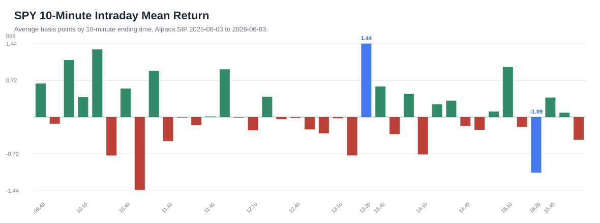
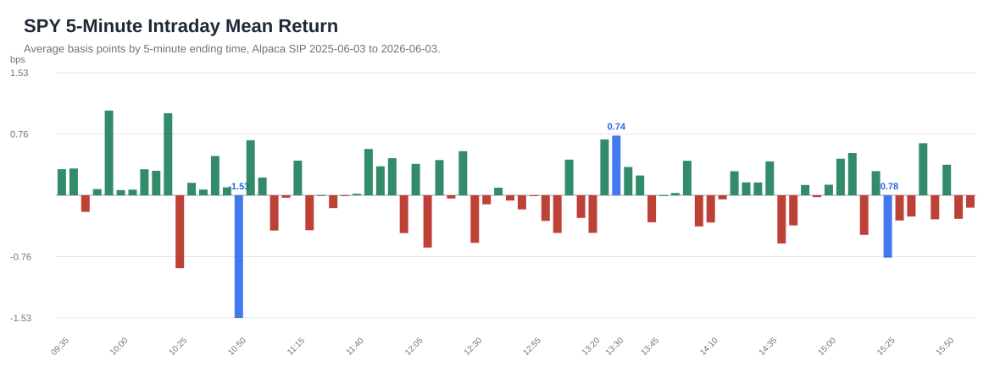
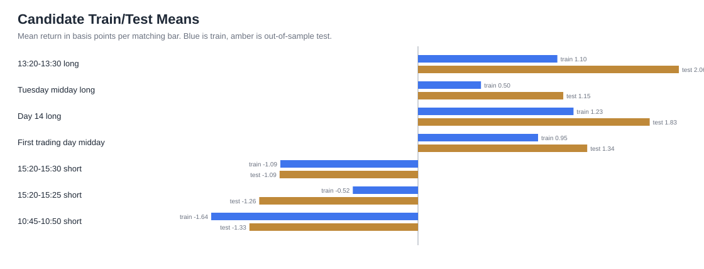
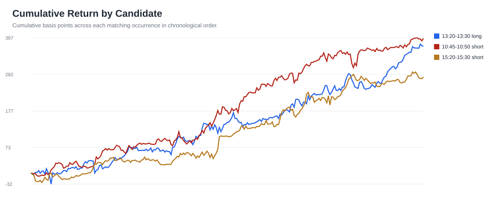
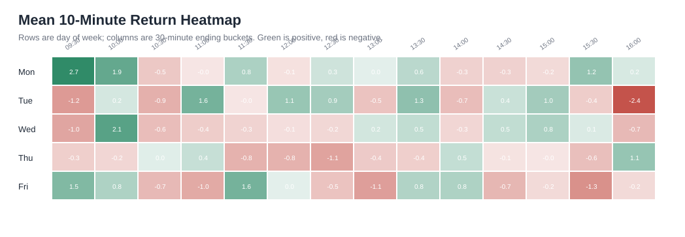

# SPY 12-Month Pattern Report

Data source: Alpaca SIP 1-minute SPY bars from 2025-06-03 through 2026-06-03.
Plain-English version: we looked at every regular market day for the last 12 months and asked, "Are there certain times or calendar situations where SPY tended to move up or down more often than normal?"

The numbers are small because these are short time windows. `1 bp` means one basis point, or 0.01%. So `+2 bps` means roughly `+0.02%` before trading costs.

This is research, not a trading recommendation.

## Executive Takeaway

The best pattern found is simple:

**SPY tended to rise between 13:20 and 13:30 New York time.**

It did not happen every day. But over the last 12 months, that 10-minute window was positive about 59% of the time and was positive in 12 of the 13 calendar months in the sample.

The other patterns are interesting, but less clean.

## Best Patterns

| Pattern | Times Tested | Avg Move | Win Rate | Strength |
|---|---:|---:|---:|---:|
| 13:20-13:30 up move | 252 | +1.4411 bps | 59.1% | Strongest clean long pattern |
| Tuesday midday up move | 954 | +0.7312 bps | 53.4% | Interesting, less consistent |
| Calendar day 14 up move | 273 | +1.4016 bps | 57.9% | Interesting calendar pattern |
| First trading day midday up move | 234 | +1.0987 bps | 57.7% | Interesting turn-of-month pattern |
| 15:20-15:30 down move | 252 | -1.0906 bps | 41.3% | Useful short-bias clue |
| 15:20-15:25 down move | 252 | -0.7769 bps | 43.3% | Narrow short-bias clue |
| 10:45-10:50 down move | 252 | -1.5284 bps | 41.3% | Strongest short-bias clue |

How to read this:

- `Times Tested` means how many matching examples were found in the year.
- `Avg Move` means the average move during that exact window.
- `Win Rate` means how often the window moved in the expected direction.
- `Strength` is my plain-English read of the pattern, not a guarantee.

## Charts

### 10-Minute Intraday Profile

This chart asks: "At each 10-minute time slot, did SPY usually move up or down?"

The bar ending at `13:30` stands out on the positive side. The bar ending at `15:30` stands out on the negative side.

### 5-Minute Intraday Profile

This zooms in closer. It helps answer whether the move is broad or concentrated in a smaller slice of time.

The `13:30` positive pattern still appears. The `10:50` and `15:25` windows show down-side pressure.

### Candidate Train/Test Means

This chart checks whether a pattern worked in both the earlier part of the year and the later part of the year.

That matters because a pattern that only worked in the past, then disappeared later, is much less useful.

### 13:30 Monthly Consistency

This is the most important chart.

It shows the 13:20-13:30 window month by month. The pattern was positive in 12 of 13 months, which makes it more interesting than a one-off lucky average.

### Cumulative Candidate Paths

This shows how each pattern built up over time.

We want to avoid patterns that only look good because of one or two lucky days. A steadier line is more interesting for further research.

### Day/Time Heatmap

This is a quick map of weekday plus time of day.

Green areas mean that time/day combination tended to be positive. Red areas mean it tended to be negative.

## What This Means In Business Terms

The best current lead is:

**If we were going to study one time-based SPY pattern further, it should be the 13:20-13:30 long window.**

The short-side windows are worth watching too, especially `10:45-10:50`, but they are not as clean as the 13:30 long pattern.

The main caution: these are small moves. A business-minded way to think about it is margin. If the average gross edge is about 1-2 bps, then trading costs, spread, execution quality, and discipline matter a lot. A pattern can be real in the data but still not be profitable after friction.

## Next Decision

The next useful step is not more theory. It is a practical viability test:

1. Estimate realistic entry/exit costs.
2. Test the 13:20-13:30 idea month by month.
3. Compare SPY against another instrument like ES futures or QQQ.
4. Build a simple paper-trading tracker before risking capital.
