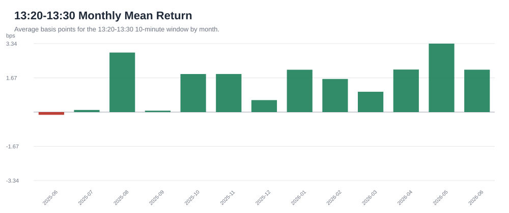
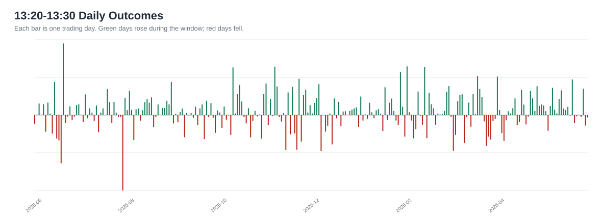

# Deep Dive: SPY 13:20-13:30 Long Window

This document expands the main takeaway from the broader SPY pattern report:

**If we were going to study one time-based SPY pattern further, it should be the 13:20-13:30 long window.**

Plain-English thesis: during the last 12 months of consolidated Alpaca SIP data, SPY tended to drift upward during this specific 10-minute window more often than normal.

This is research, not investment advice.

## The Pattern

- Instrument: SPY
- Data source: Alpaca SIP consolidated 1-minute bars
- Window studied: 13:20 to 13:30 New York time
- Test style: buy/observe at the 13:20 close, exit/observe at the 13:30 close
- Sample period: 2025-06-03 through 2026-06-03
- Trading days tested: 252

## Executive Read

This is the cleanest time-based long pattern we found. It is not huge, and it does not win every day. The reason it deserves more study is that it checks several business-practical boxes:

- It is simple to explain.
- It happens once per trading day, so it is easy to monitor.
- It worked in both the earlier and later parts of the 12-month sample.
- It was positive in 12 of 13 calendar months.
- It also appeared in the IEX data pass, then confirmed again in the fuller SIP data pass.

## Key Numbers

| Measure | Result | Plain-English Meaning |
|---|---:|---|
| Average move | +1.4411 bps | Average gross move during this 10-minute window |
| Win rate | 59.1% | Percent of days the window was positive |
| Days tested | 252 | One observation per regular trading day |
| Total gross move | +363.2 bps | Sum of the window's daily moves before costs |
| Median day | +1.1282 bps | The middle result, less affected by outlier days |
| 25th percentile | -2.5563 bps | A weaker-but-normal day |
| 75th percentile | +5.6524 bps | A stronger-but-normal day |
| Best day | 2025-06-23 / +32.5912 bps | Largest positive day in this window |
| Worst day | 2025-07-31 / -34.2743 bps | Largest negative day in this window |

## Did It Hold Up Later?

We split the year into an earlier training period and a later test period. That is a simple way to ask: did the idea only look good in the past, or did it keep working later?

| Period | Days | Avg Move | Win Rate | Total Gross Move |
|---|---:|---:|---:|---:|
| Earlier period | 163 | +1.1018 bps | 58.9% | +179.6 bps |
| Later period | 89 | +2.0625 bps | 59.6% | +183.6 bps |

The later period was actually stronger than the earlier period. That does not prove the pattern will continue, but it is better than seeing the idea fade immediately after discovery.

## Month-by-Month Check

This is the most useful sanity check for a business reader. We do not want a pattern that only exists because of one lucky month.

Result: 12 positive months and 1 negative month.

| Month | Days | Avg Move | Win Rate | Total Gross Move |
|---|---:|---:|---:|---:|
| 2025-06 | 19 | -0.1327 bps | 47.4% | -2.5 bps |
| 2025-07 | 22 | +0.1034 bps | 59.1% | +2.3 bps |
| 2025-08 | 21 | +2.9028 bps | 76.2% | +61.0 bps |
| 2025-09 | 21 | +0.0684 bps | 52.4% | +1.4 bps |
| 2025-10 | 23 | +1.8546 bps | 56.5% | +42.7 bps |
| 2025-11 | 19 | +1.8557 bps | 52.6% | +35.3 bps |
| 2025-12 | 22 | +0.5832 bps | 63.6% | +12.8 bps |
| 2026-01 | 20 | +2.0642 bps | 60.0% | +41.3 bps |
| 2026-02 | 19 | +1.6137 bps | 57.9% | +30.7 bps |
| 2026-03 | 22 | +0.9919 bps | 54.5% | +21.8 bps |
| 2026-04 | 21 | +2.0740 bps | 57.1% | +43.6 bps |
| 2026-05 | 20 | +3.3368 bps | 75.0% | +66.7 bps |
| 2026-06 | 3 | +2.0675 bps | 33.3% | +6.2 bps |

## Daily Outcome View

This chart shows every trading day as an individual result. Green lines are positive days; red lines are negative days.

## Why This Pattern Might Exist

We do not know the cause from this data alone. A few plausible business-level explanations are:

- Midday liquidity may normalize after the morning rush.
- Larger desks may be repositioning after morning information is digested.
- The market may be setting up for afternoon flows before the final-hour activity begins.
- It may simply be a temporary market rhythm that worked during this specific year.

The last point matters. A pattern can be real in one sample and still stop working later.

## Why This Is Not Yet A Trade

The average move is small. That means execution quality matters. A gross edge of 1-2 bps can disappear quickly if the trade has poor fills, spread cost, bad timing, or emotional overrides.

Before turning this into anything live, we would need to answer:

1. What does the move look like after realistic spread and slippage?
2. Does it hold on QQQ, ES futures, or another independent S&P 500 proxy?
3. Does it hold if we test the next 30-60 trading days without changing the rule?
4. Does it survive simple risk controls, such as skipping high-volatility event days?
5. Is the expected edge large enough to justify operational attention?

## Practical Next Step

The next business decision is simple: paper-track this exact rule without modifying it.

For the next 30 trading days, record:

- SPY price at 13:20
- SPY price at 13:30
- Gross result in bps
- Approximate spread/slippage
- Whether any major market event happened that day

If the pattern continues to behave similarly out of sample, then it becomes worth deeper execution research. If it disappears, we learned quickly and cheaply.