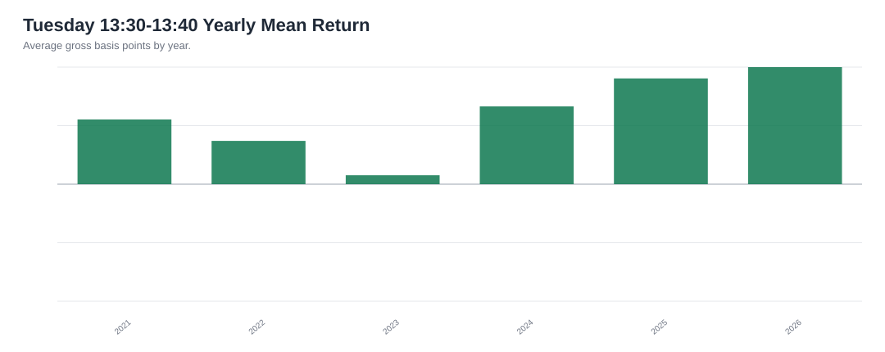
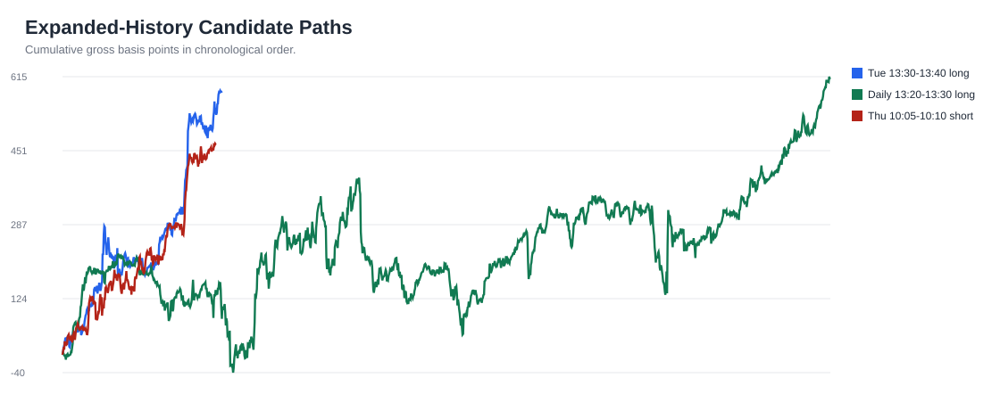

# SPY Expanded Pattern Report: 2021-2026

Data source: Alpaca SIP consolidated 1-minute SPY bars. Regular-session analysis window: 2021-01-04 through 2026-06-03.

Plain-English update: adding the 2021-2026 history changes the lead pattern. The original 13:20-13:30 window is still interesting, but the stronger multi-year timing lead is more specific:

**Tuesday 13:30-13:40 New York time showed the cleanest intraday long behavior in the expanded sample.**

This is research, not investment advice.

## Executive Takeaway

The old 12-month report pointed at 13:20-13:30 as the best daily window. With more than five years of data, that exact daily window becomes less dominant. The broader 13:30 area still matters, but the stronger version is Tuesday-specific and ends at 13:40.

The practical read:

- Do not throw away the 13:30 idea.
- Refine it: study Tuesday 13:30-13:40 first.
- Treat March 14:00-hour behavior as a separate seasonal hypothesis.
- Treat all calendar-specific findings as hypotheses, because more combinations create more chances for accidental patterns.

## Best Expanded-History Patterns

| Pattern | Full Avg | Full Win | Train Avg | Test Avg | Test Win | Test Days | Read |
|---|---:|---:|---:|---:|---:|---:|---|
| Tuesday 13:30-13:40 up move | +2.0536 bps | 60.6% | +1.5254 bps | +3.0301 bps | 60.6% | 99 | Best simple intraday lead |
| Daily 13:20-13:30 up move | +0.4480 bps | 54.5% | +0.3495 bps | +0.6308 bps | 52.5% | 476 | Weaker alone, but part of the 13:30 zone |
| Daily 13:20-13:40 zone | +0.5589 bps | 53.6% | +0.4085 bps | +0.8382 bps | 52.9% | 952 | Broad 13:30-area support |
| March 14:00 hour up move | +1.4140 bps | 55.8% | +1.0512 bps | +2.1649 bps | 57.8% | 258 | Strong seasonal/calendar hypothesis |
| 3rd day 15:00 hour down move | -2.1421 bps | 43.8% | -1.8543 bps | -2.6631 bps | 43.2% | 95 | Calendar short-bias hypothesis |
| Thursday 10:05-10:10 down move | -1.7058 bps | 43.8% | -1.2273 bps | -2.6269 bps | 43.0% | 93 | Best 5-minute short-bias lead |

## Tuesday 13:30-13:40 Deep Read

This pattern appeared in 282 Tuesday observations and was positive in 6 of 6 years represented in the expanded sample.

| Year | Days | Avg Move | Win Rate | Total Gross Move |
|---|---:|---:|---:|---:|
| 2021 | 52 | +2.0517 bps | 73.1% | +106.7 bps |
| 2022 | 52 | +1.3716 bps | 51.9% | +71.3 bps |
| 2023 | 51 | +0.2826 bps | 52.9% | +14.4 bps |
| 2024 | 53 | +2.4678 bps | 66.0% | +130.8 bps |
| 2025 | 52 | +3.3515 bps | 57.7% | +174.3 bps |
| 2026 | 22 | +3.7106 bps | 63.6% | +81.6 bps |

## Candidate Path Comparison

This chart compares how the strongest expanded-history leads accumulated over time. The goal is to spot whether a pattern built gradually or relied on a single lucky patch.

## What Changed From The 12-Month Report?

The earlier report was not wrong; it was narrower. In the last 12 months, 13:20-13:30 looked unusually clean. When we add 2021, 2022, 2023, and 2024, the signal is still nearby but shifts into a more specific version: Tuesday 13:30-13:40 and the broader 13:30 zone.

That is exactly why expanding the history was useful. It prevented us from overcommitting to one recent-year pattern.

## Next Decision

The next practical study should paper-track two variants side by side:

1. The original daily 13:20-13:30 window.
2. The refined Tuesday 13:30-13:40 window.

For each observation, record gross move, estimated spread/slippage, and whether the day had a major market event. If Tuesday 13:30-13:40 continues to lead over the next 30-60 trading days, it becomes the better candidate for execution research.